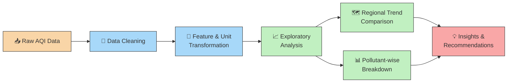
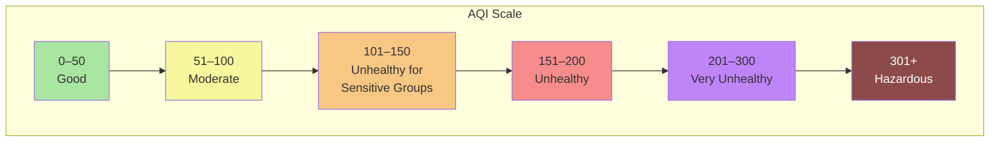

<div align="center">

# 🌫️ AQI Index Analysis

### End-to-End Exploratory Data Analysis of Air Quality Trends

[](https://www.python.org/)
[](https://pandas.pydata.org/)
[](https://matplotlib.org/)
[](https://seaborn.pydata.org/)
[](#license)

*Cleaning, analyzing, and visualizing air pollution data to surface regional trends and actionable environmental insights.*

</div>

---

## 📋 Overview

**AQI Index Analysis** is a data science project that performs a complete exploratory data analysis (EDA) pipeline on Air Quality Index (AQI) datasets. It walks from raw, messy environmental data to clear, decision-ready visual insights — the kind of workflow an environmental analyst or data scientist would use to understand pollution patterns across regions and time.

**What this project does:**
- 🧹 Cleans and transforms raw AQI datasets (handling missing values, inconsistent units, and outliers)
- 📊 Builds visualizations comparing pollution trends across regions and over time
- 🔍 Surfaces actionable insights for environmental monitoring and awareness
- 🧠 Demonstrates a full EDA workflow using industry-standard Python tooling

> **Note:** This project uses a publicly-structured / synthetic AQI dataset for demonstration purposes — the pipeline and techniques are directly transferable to real-world monitoring station data.

---

## 🖼️ Project Workflow



---

## 🧪 AQI Category Reference

A quick visual guide to how AQI values map to health categories — useful context for interpreting the charts in this project.



---

## 🛠️ Tech Stack

| Layer | Tools |
|---|---|
| **Language** | Python 3.9+ |
| **Data Handling** | Pandas, NumPy |
| **Visualization** | Matplotlib, Seaborn |
| **Environment** | Jupyter Notebook |

---

## 📂 Repository Structure

```
aqi-index/
├── data/                   # Raw and processed AQI datasets
├── notebooks/               # EDA notebooks (cleaning → analysis → visualization)
├── visuals/                 # Exported charts and figures
├── requirements.txt         # Project dependencies
└── README.md
```

> Update this section to match your actual folder layout once the zipped project contents are extracted into the repo.

---

## 🚀 Getting Started

1. **Clone the repository**
   ```bash
   git clone https://github.com/Chukunju/aqi-index.git
   cd aqi-index
   ```

2. **Install dependencies**
   ```bash
   pip install -r requirements.txt
   ```

3. **Run the analysis**
   ```bash
   jupyter notebook notebooks/aqi_analysis.ipynb
   ```

---

## 📊 Sample Insights

- Pollution levels show clear **seasonal and regional variation**, useful for identifying high-risk periods.
- Certain pollutants (e.g., PM2.5, PM10) consistently drive AQI spikes more than others — highlighted through comparative visualizations.
- Regional comparisons help pinpoint areas that may need targeted environmental intervention.

*(Add your actual exported chart images here, e.g. ``, once they're in the repo — this makes the README instantly scannable for recruiters.)*

---

## 🎯 Why This Project

This project was built as a portfolio piece to demonstrate a complete, real-world EDA workflow — from messy raw data to clear, actionable visual insights — using the core Python data science stack.

---

## 📄 License

This project is available under the [MIT License](LICENSE).

<div align="center">

**⭐ If you find this project useful, consider giving it a star!**

</div>
